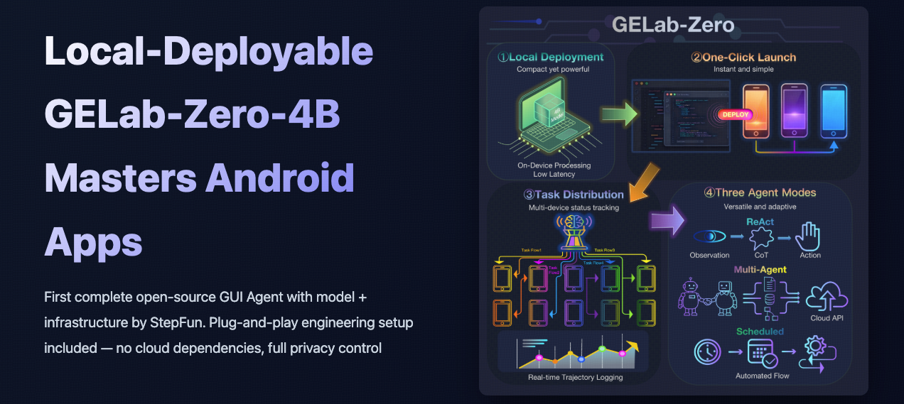

> 👋 Hi, everyone! We are proud to present the first fully open-source GUI Agent with both model and infrastructure. Our solution features plug-and-play engineering with no cloud dependencies, giving you complete privacy control.

<p align="center">
  <!-- <a href="https://github.com/stepfun-ai/gelab-zero"></a> -->
  <a href="https://opengelab.github.io/"></a>
  <a href="https://huggingface.co/stepfun-ai/GELab-Zero-4B-preview"></a>
  <a href="https://huggingface.co/stepfun-ai/AndroidDaily"></a>
</p>

<p align="center">
  <a href="./README.md">English</a> |
  <a href="./README_CN.md">简体中文</a>
</p>

## 📰 News

* 🎁 **[Coming Soon...]**
* 🎁 **[2025-11]** We release a lightweight [**4B model**](https://huggingface.co/stepfun-ai/GELab-Zero-4B-preview).
* 🎁 **[2025-11]** We release the tasks from the [**AndroidDaily**](https://huggingface.co/stepfun-ai/AndroidDaily) benchmark.
* 🎁 **[2025-11]** We release the current **GELab-Zero** engineering infrastructure.
* 🎁 **[2025-10]** Our [research paper](https://github.com/summoneryhl/GE-Lab) on **Multi-Turn RL** is accepted by **NeurIPS 2025**.

## 📑 Table of Contents

- [📖 Background](#-background)
- [🎥 Application Demonstrations](#-application-demonstrations)
- [📊 AndroidDaily](#-androiddaily-a-self-built-benchmark-close-to-daily-life)
- [🏆 Open Benchmark](#-open-benchmark)
- [🚀 Installation & Quick Start](#-installation-quick-start)
- [📝 Citation](#-citation)
- [📧 Contact](#-contact)

## 📖 Background

As AI experiences continue to penetrate consumer-grade terminal devices, mobile Agent research is at a critical juncture transitioning from "feasibility verification" to "large-scale application." GUI-based solutions have emerged as the optimal approach for the current stage in addressing complex mobile ecosystems and achieving scalable Agent capabilities, thanks to their universal compatibility with all apps and zero-cost integration without requiring app vendor adaptation. However, due to the highly fragmented nature of mobile application ecosystems, getting GUI Agents to truly work across different brands and device models often faces numerous engineering challenges: multi-device ADB connections, dependency installation, permission configuration, inference service deployment, task recording and replay. This means Agent developers and MCP users need to handle substantial engineering infrastructure work, making it difficult to focus on strategic innovation.

To address this challenge, we are open-sourcing GELab-Zero to accelerate the innovation and application deployment of GUI Agents. It consists of two main components:

- Plug-and-play complete inference engineering infrastructure that handles all the heavy lifting
- A 4B GUI Agent model capable of running on local computer

It provides a one-click launch experience similar to open-source GUI Agent MCP, can be deployed entirely locally, and puts the entire inference pipeline under your complete control. Specific capabilities include:

- **Local Deployment**: Supports 4B-scale models running on consumer-grade hardware, balancing low latency with privacy.
- **One-click Launch**: Provides unified deployment pipeline that automatically handles environment dependencies and device management.
- **Task Distribution**: Can distribute tasks to multiple phones while recording interaction trajectories for observability and reproducibility.
- **Three Agent Modes**: Covers multiple working modes including ReAct loops, multi-agent collaboration, and scheduled tasks.

These capabilities enable GELab-Zero to flexibly handle complex task flows in real-world scenarios and provide a solid foundation for future extensions.

For Agent developers, this infrastructure enables rapid testing of new ideas and strategies, validating interaction approaches; for enterprise users, it allows direct reuse of this infrastructure to quickly integrate MCP capabilities into product business.

## 🎥 Application Demonstrations

### Recommendation - Sci-Fi Movies

Task: Help me find any good recent sci-fi movies

**[📹 Click to view demo video](./images/video_2.mp4)**

### Recommendation - Travel Destination

Task: Help me find a place where I can take my kids on the weekend

**[📹 Click to view demo video](./images/video_4.mp4)**

### Practical Task - Claim Subsidy

Task: Claim meal vouchers on the enterprise welfare platform

**[📹 Click to view demo video](./images/video_3.mp4)**

### Practical Task - Metro Line Query

Task: Check if Metro Line 1 is operating normally, then navigate to the nearest entrance of Line 1 metro station

**[📹 Click to view demo video](./images/video_5.mp4)**

### Complex Task - Multi-Item Shopping

Task: Go to the nearest Hema Fresh Store on Ele.me and purchase: Red strawberries 300g, Peruvian Bianca blueberries 125g (18mm diameter), seasonal fresh yellow potatoes 500g, sweet baby pumpkin 750g, Hema large grain shrimp sliders, 2 bottles of Hema pure black soy milk 300ml, Little Prince macadamia nut cocoa crisp 120g, Hema spinach noodles, Hema five-spice beef, 5 bags of Haohuan snail Liuzhou river snail rice noodles (extra spicy extra smelly) 400g, m&m's milk chocolate beans 100g

**[📹 Click to view demo video](./images/video_1.mp4)**

### Complex Task - Information Retrieval

Task: Search for 'how to learn financial management' on Zhihu and view the first answer with over 10k likes

**[📹 Click to view demo video](./images/video_6.mp4)**

### Complex Task - Conditional Search

Task: Find a pair of white canvas shoes in size 37 on Taobao, priced under 100 yuan, then add the first item that meets the criteria to favorites

**[📹 Click to view demo video](./images/video_7.mp4)**

### Complex Task - Online Quiz

Task: Go to Baicizhan and help me complete the vocabulary learning task

**[📹 Click to view demo video](./images/video_8.mp4)**

## 📊 AndroidDaily: A Self-Built Benchmark Close to Daily Life

Current mainstream benchmarks mostly focus on productivity applications (such as email), but users' daily high-frequency usage is dominated by lifestyle service applications (such as food delivery, ride-hailing, social media, payments, etc.), and these scenarios better reflect the practical value of current GUI Agents.

To this end, we propose AndroidDaily: a multi-dimensional dynamic benchmark for the real world. We focus on empirical analysis of six core dimensions of modern life (food, transportation, shopping, housing, information consumption, entertainment), prioritizing popular applications that dominate these categories. This makes the tasks in the benchmark characterized by real-world interaction results (such as transaction payments, service bookings) and tight online-offline inheritance.

To balance evaluation comprehensiveness and execution efficiency, AndroidDaily adopts two evaluation modes:

### Static Testing

Contains 3146 actions. Provides task descriptions and step-by-step screenshots, requiring the Agent to predict the action type and action value (such as click coordinates, input text) for each step, primarily evaluating numerical accuracy. This method requires no complex engineering infrastructure and enables rapid, cost-effective large-scale model iteration and testing.

The action type distribution in static testing is as follows (total 3146 actions):

- **CLICK**: 1354 times - Click operations
- **COMPLETE**: 410 times - Task completion
- **AWAKE**: 528 times - App activation
- **TYPE**: 371 times - Text input
- **INFO**: 305 times - Information query
- **WAIT**: 85 times - Wait operations
- **SLIDE**: 93 times - Slide operations

#### AndroidDaily Static Benchmark Results


| Model                   | Accuracy  |
| ------------------------- | ----------- |
| GPT-4o                  | 0.196     |
| Gemini-2.5-pro-thinking | 0.366     |
| UI-TARS-1.5             | 0.470     |
| GELab-Zero-4B-preview   | **0.734** |

### End-to-End Benchmark

Contains 235 tasks. Conducted in a fully functional test environment (such as real devices or emulators), the Agent needs to autonomously execute tasks from start to finish, with overall task success rate as the evaluation metric. This setup has the highest ecological validity and truly reflects the Agent's comprehensive capabilities in complex environments.

The scenario distribution in the end-to-end benchmark is as follows:

- **Transportation**: 78 tasks (33.19%) - Ride-hailing, navigation, public transit, etc.
- **Shopping**: 61 tasks (25.96%) - E-commerce shopping, payment, order management, etc.
- **Social Communication**: 43 tasks (18.3%) - Messaging, social interactions, etc.
- **Content Consumption**: 37 tasks (15.74%) - News reading, video watching, content bookmarking, etc.
- **Local Services**: 16 tasks (6.81%) - Food delivery, on-site services, etc.


Typical tasks include ride-hailing, shopping, message sending, content bookmarking, food delivery ordering, etc. GELab-Zero-4B-preview achieves 75.86% success rate on AndroidWorld testing, demonstrating excellent performance on complex mobile tasks.

## 🏆 Open Benchmark

We conducted comprehensive evaluations of GELab-Zero-4B-preview model across multiple open-source benchmarks, covering various dimensions including GUI understanding, localization, and interaction. The comparison results with other open-source models are shown below:


The benchmark results demonstrate that GELab-Zero-4B-preview exhibits exceptional performance across multiple open-source benchmarks, with particularly outstanding results in real mobile scenarios (Android World), proving its strong capabilities in practical applications.

## 🚀 Installation& Quick Start

<!-- EN -->

End-to-end inference requires just a few simple steps:

1. Set up LLM inference environment (ollama or vllm)
2. Set up Android device execution environment (adb configuration) and enable developer mode
3. Set up Agent runtime environment (gelab-zero one-click deployment script)
4. Set up trajectory visualization environment (optional)
   The third-party infrastructure dependencies mentioned above are very mature, so don't be afraid.

We assume you have installed Python 3.12+ environment and have a certain command line operation foundation. If you have not installed the python environment yet, please refer to Step 0 for installation.

### Step 0: Python Environment Setup

<!-- EN -->

If you have not installed Python 3.12+ environment yet, you can refer to the following steps for installation:
For commercial friendliness and cross-platform support, we recommend using miniforge for Python environment installation and management. Official website: https://github.com/conda-forge/miniforge

<!-- EN -->

- **Windows Users**:
  1. Download and install miniforge using the command line:

```powershell
# Download and install Miniforge3 Windows version
start /wait "" Miniforge3-Windows-x86_64.exe /InstallationType=JustMe /RegisterPython=0 /S /D=%UserProfile%\Miniforge3
```

<!-- EN -->

- **MAC and Linux Users**:
  1. Download and install miniforge using the command line:

```bash
curl -L -O "https://github.com/conda-forge/miniforge/releases/latest/download/Miniforge3-$(uname)-$(uname -m).sh"
bash Miniforge3-$(uname)-$(uname -m).sh
```

After installation, create and activate a new Python environment:

```bash
conda create -n gelab-zero python=3.12 -y
conda activate gelab-zero
```

### Step 1: LLM Inference Environment Setup

We have verified two mainstream LLM local inference deployment methods: ollama and vllm. Personal users are recommended to use the ollama method, while enterprise users and those with certain technical backgrounds can choose the vllm method for more stable inference services.

#### Step 1.1: Ollama Setup (Recommended for Personal Users)

<!-- https://ollama.com/ -->

<!-- EN -->

For personal users doing local inference, we strongly recommend using the Ollama method for local deployment. This method has the advantages of simple installation and convenient use.

- MAC and Windows users can directly download from the official website and install visually: https://ollama.com/.
- Linux users can refer to the official documentation for installation: https://ollama.com/download/linux. The one-click installation command for Linux users is as follows:

```bash
# Download the latest Ollama AppImage for Linux
curl -fsSL https://ollama.com/install.sh | sh
````

#### Step 1.2: GELab-Zero-4B-preview Model Setup

<!-- EN -->

After completing the ollama installation, you need to download and deploy the gelab-zero-4b-preview model using the following commands:

```bash
# To install huggingface cli if you don't have it
pip install huggingface_hub

# Download and install gelab-zero-4b-preview model
huggingface-cli download --resume-download stepfun-ai/GELab-Zero-4B-preview --local-dir gelab-zero-4b-preview

# Import the model into ollama
cd gelab-zero-4b-preview
ollama create gelab-zero-4b-preview -f Modelfile
```

To test if the model is installed successfully, you can use the following command:

```bash
curl -X POST http://localhost:11434/v1/chat/completions \
 -H "Content-Type: application/json" \
 -d '{
       "model": "gelab-zero-4b-preview",
       "messages": [{"role": "user", "content": "Hello, GELab-Zero!"}]
     }'
```

The expected output should include the model's reply content, indicating that the model has been successfully installed and is running. For example:

```json
{"id":"chatcmpl-174","object":"chat.completion","created":1764405566,"model":"gelab-zero-4b-preview","system_fingerprint":"fp_ollama","choices":[{"index":0,"message":{"role":"assistant","content":"Hello! I'm here to help with any questions or information you might need. How can I assist you today?"},"finish_reason":"stop"}],"usage":{"prompt_tokens":16,"completion_tokens":24,"total_tokens":40}}
```

After completing the above steps, it indicates that your ollama environment and gelab-zero-4b-preview model have been successfully installed, and you can proceed to the next step of configuring the mobile execution environment.

### Step 2: Android Device Execution Environment Setup

To enable GELab-Zero to control the phone for task execution, you need to complete the following steps to configure the mobile execution environment:

1. Enable developer mode and USB debugging on the phone.
2. Install the ADB tool and ensure that the computer can connect to the phone via ADB. (If you have already installed the adb tool, you can skip this step)
3. Connect the phone to the computer via a USB cable and use the adb devices command to confirm a successful connection.

#### Step 2.1: Enable Developer Mode and USB Debugging

<!-- EN -->

Generally, you can enable developer mode and USB debugging on Android phones by following these steps:

1. Go to the "Settings" app on your phone.
2. Find the "About Phone" or "System" option, and tap on the "Build Number" 10+ times until you see a message saying "You are now a developer."
3. Go back to the main "Settings" menu and find "Developer Options."【Important, must enable】
4. In "Developer Options," find and enable the "USB Debugging" feature. Follow the on-screen instructions to enable USB debugging.【Important, must enable】

Different phone brands may have slight variations, so please adjust according to your specific situation. Generally, searching for "<phone brand> how to enable developer mode" will yield relevant tutorials.
After completing the setup, it should look like the image below:

<div style="display: flex; align-items: center; justify-content: center; width: 80%; margin: 0 auto;">
  
  
</div>

#### Step 2.2: Install ADB Tool

<!-- EN -->

ADB (Android Debug Bridge) is a bridge tool for communication between Android devices and computers. You can install the ADB tool by following these steps:

- **Windows Users**:
  1. Download the ADB tool package: https://dl.google.com/android/repository/platform-tools-latest-windows.zip and extract it to a suitable location.
  2. Add the extracted folder path to the system environment variables so that you can use the adb command directly in the command line. For detailed steps, see: https://learn.microsoft.com/en-us/previous-versions/office/developer/sharepoint-2010/ee537574(v=office.14). The specific steps include:

```
1. Right-click "Computer" in the "Start" menu and select "Properties."
2. Click "Advanced system settings."
3. In the "System Properties" dialog box, click the "Environment Variables" button.
4. In the "System variables" section, find and select the "Path" variable, then click the "Edit" button.
5. In the "Edit Environment Variables" dialog box, click "New," and then enter the extracted path of the ADB tool package.
6. Click "OK" to save the changes and close all dialog boxes.
```

- **MAC and Linux Users**:

1. You can install the ADB tool using Homebrew (Mac) or package managers (Linux). If you don't have Homebrew installed, you should install it first with the command:

```bash
ruby -e $(curl -fsSL https://raw.githubusercontent.com/Homebrew/install/master/install)
```

2. Then use the following command to install the ADB tool:

```bash
brew cask install android-platform-tools
```

#### Step 2.3: Connect Android Device to Computer

<!-- EN -->

After connecting your phone to the computer using a USB cable, open a terminal or command prompt and

```bash
adb devices
```

<!-- EN -->

If the connection is successful, you will see an output similar to the following, showing the list of connected devices:

```bash
List of devices attached
AN2CVB4C28000731        device
```

If you do not see any devices, please check if the USB cable and the USB debugging settings on your phone are correctly enabled. When connecting the phone for the first time, an authorization prompt may pop up on the phone; simply select "Allow." As shown in the image below:

<!-- 50% size -->

{width=20%}

If the installation is unsuccessful, you can refer to third-party documentation: https://github.com/quickappcn/issues/issues/120 for further troubleshooting.

### Step 3: GELab-Zero Agent Runtime Environment Setup

After completing the above steps, you can deploy the GELab-Zero runtime environment with the following command:

```bash
# Clone the repository
git clone https://github.com/stepfun-ai/gelab-zero
cd gelab-zero

# Install dependencies
pip install -r requirements.txt

# To inference a single task
python examples/run_single_task.py
```

### (Optional) Step 4: Trajectory Visualization Environment Setup

The trajectory will be defult saved in the `running_log/server_log/os-copilot-local-eval-logs/` directory. You can visualize the trajectory using streamlit:

```bash
streamlit run --server.address 0.0.0.0 visualization/main_page.py --server.port 33503
```

Then open your browser and go to `http://localhost:33503` to access the visualization interface.

Each task execution will generate a unique session ID, which can be used to query and visualize the corresponding trajectory in the visualization interface.

The action with point(s) such as click and slide will be marked on the screenshot for better understanding of the agent's behavior.

---

## 📝 Citation

If you find GELab-Zero useful for your research, please consider citing our work :)

```bibtex
@software{gelab_zero_2025,
  title={GELab-Zero: An Advanced Mobile Agent Inference System},
  author={GELab Team},
  year={2025},
  url={https://github.com/stepfun-ai/gelab-zero}
}

@inproceedings{gelab_mt_rl,
  title={GUI Exploration Lab: Enhancing Screen Navigation in Agents via Multi-Turn Reinforcement Learning},
  author={Yan, Haolong and Shen, Yeqing and Huang, Xin and Wang, Jia and Tan, Kaijun and Liang, Zhixuan and Li, Hongxin and Ge, Zheng and Yoshie, Osamu and Li, Si and others},
  booktitle={The Thirty-ninth Annual Conference on Neural Information Processing Systems}
}

```

## 📧 Contact

For questions and support, please contact: [tankaijun@stepfun.com]
