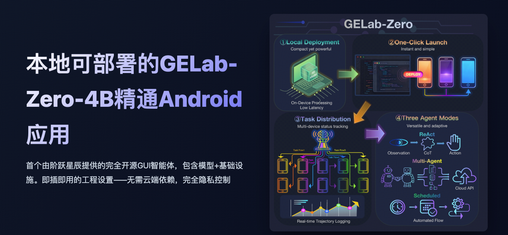
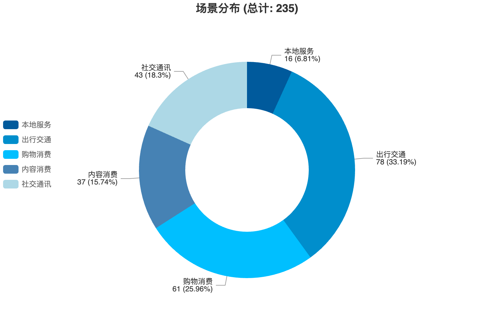
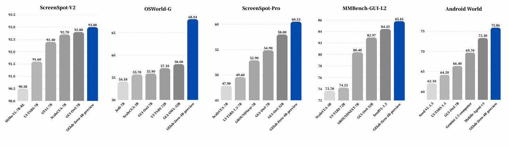
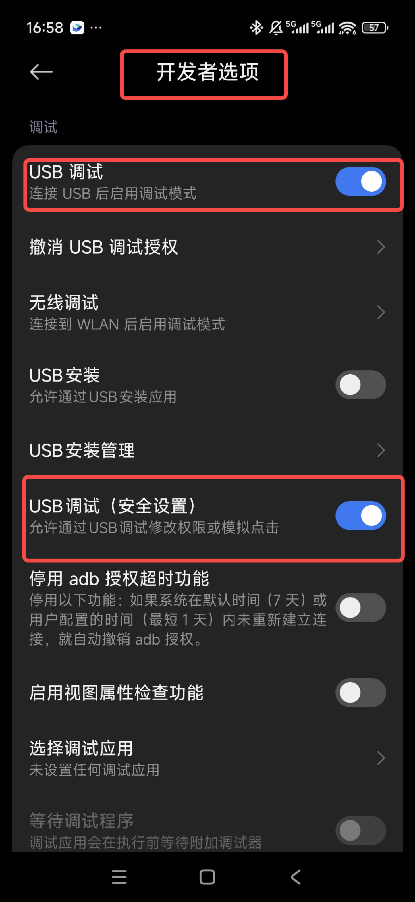
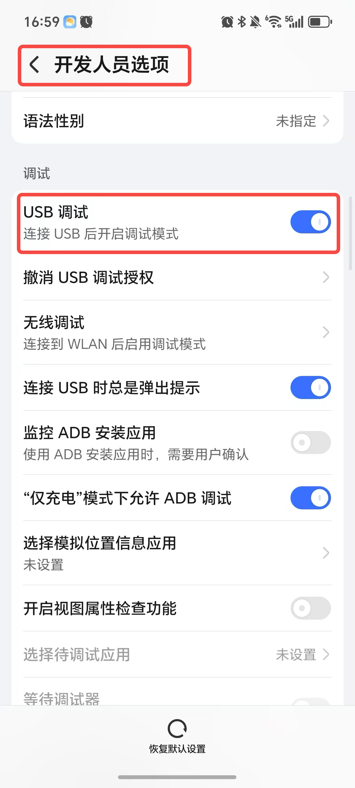
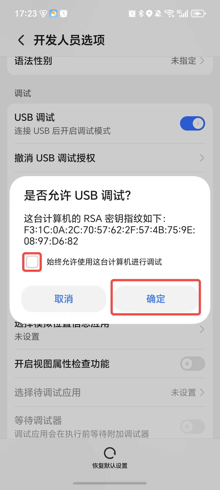

> 👋 大家好！我们很荣幸推出首个同时包含模型和基础设施的全开源 GUI Agent。我们的解决方案主打即插即用的工程化体验，无需依赖云端，赋予您完全的隐私控制权。


<p align="center">
  <!-- <a href="https://github.com/stepfun-ai/gelab-zero"></a> -->
  <a href="https://opengelab.github.io/"></a>
  <a href="https://huggingface.co/stepfun-ai/GELab-Zero-4B-preview"></a>
  <a href="https://huggingface.co/stepfun-ai/AndroidDaily"></a>
</p>

<p align="center">
  <a href="./README.md">English</a> |
  <a href="./README_CN.md">简体中文</a>
</p>


## 📰 新闻
*   🎁 **[即将推出...]**
*   🎁 **[2025-11]** 我们发布了轻量级的 [**4B 模型**](https://huggingface.co/stepfun-ai/GELab-Zero-4B-preview)。
*   🎁 **[2025-11]** 我们发布了来自 [**AndroidDaily**](https://huggingface.co/stepfun-ai/AndroidDaily) 基准测试的任务。
*   🎁 **[2025-11]** 我们发布了当前的 **GELab-Zero** 工程基础设施。
*   🎁 **[2025-10]** 我们关于 **Multi-Turn RL** 的[研究论文](https://github.com/summoneryhl/GE-Lab)被 **NeurIPS 2025** 接收。

## 📑 目录

- [📖 背景](#-background)
- [🎥 应用演示](#-application-demonstrations)
- [📊 AndroidDaily](#-androiddaily-a-self-built-benchmark-close-to-daily-life)
- [🏆 开放基准测试](#-open-benchmark)
- [🚀 安装 & 快速开始](#-installation-quick-start)
- [📝 引用](#-citation)
- [📧 联系方式](#-contact)


## 📖 背景

随着 AI 体验不断向消费级终端设备渗透，移动端 Agent 研究正处于从“可行性验证”向“大规模应用”转型的关键节点。基于 GUI 的解决方案凭借其对所有 App 的通用兼容性以及无需 App 厂商适配的零成本接入优势，已成为当前阶段应对复杂移动生态、实现 Agent 能力规模化的最佳路径。然而，由于移动应用生态的高度碎片化，要让 GUI Agent 在不同品牌、不同型号的设备上真正跑通，往往面临着海量的工程挑战：多设备 ADB 连接、依赖安装、权限配置、推理服务部署、任务编排与回放等。这意味着 Agent 开发者和 MCP 用户需要处理大量的工程基建工作，难以专注于策略创新。

为了解决这一挑战，我们开源了 GELab-Zero 以加速 GUI Agent 的创新与应用落地。它由两个主要部分组成：

- 即插即用的完整推理工程基础设施，帮您搞定所有脏活累活
- 一个可本地运行的4B GUI Agent 模型

它提供了类似开源 GUI Agent MCP 的一键启动体验，支持完全本地化部署，并将整个推理链路置于您的完全控制之下。具体能力包括：

- 轻量级本地推理：支持 4B 规模模型在消费级硬件上运行，兼顾低延迟与隐私。
- 一键任务启动：提供统一的部署流水线，自动处理环境依赖与设备管理。
- 多设备任务分发：可将任务分发至多台手机，同时记录交互轨迹以供观测与复现。
- 多种Agent模式：覆盖 ReAct模式、Multi-Agent模式、定时任务等多种工作模式。

这些能力使 GELab-Zero 能够灵活应对真实场景下的复杂任务流，并为未来的扩展提供坚实基础。

对于 Agent 开发者，这套基建能够支持新想法、新策略的快速测试，验证交互方案；对于企业用户，则可以直接复用这套基建，将 MCP 能力快速集成到产品业务中。

## 🎥 应用演示


###  推荐 - 科幻电影
任务：帮我找一些最近好看的科幻电影

**[📹 点击查看演示视频](./images/video_2.mp4)**

###  推荐 - 旅游目的地
任务：帮我找一个周末适合带孩子去的地方

**[📹 点击查看演示视频](./images/video_4.mp4)**


###  实用任务 - 领取补贴
任务：在企业福利平台上领取餐补

**[📹 点击查看演示视频](./images/video_3.mp4)**

### 实用任务 - 地铁线路查询
任务：检查地铁 1 号线是否正常运行，然后导航到最近的 1 号线地铁站入口

**[📹 点击查看演示视频](./images/video_5.mp4)**


### 复杂任务 - 多商品购物
任务：在饿了么上前往最近的盒马鲜生门店购买：红颜草莓 300g、秘鲁比安卡蓝莓 125g（果径18mm+）、当季鲜黄土豆 500g、贝贝南瓜 750g、盒马大颗粒虾滑、2 瓶盒马醇豆浆（黑豆）300ml、小王子澳洲坚果可可脆 120g、盒马菠菜手擀面、盒马五香酱牛肉、5 袋好欢螺柳州螺蛳粉（加辣加臭版）400g、m&m's 牛奶巧克力豆 100g

**[📹 点击查看演示视频](./images/video_1.mp4)**


### 复杂任务 - 信息检索
任务：在知乎上搜索“如何学习理财”，并查看第一个点赞超过 1万 的回答

**[📹 点击查看演示视频](./images/video_6.mp4)**

### 复杂任务 - 条件搜索
任务：在淘宝上找一双 37 码的白色帆布鞋，价格在 100 元以内，然后收藏第一个符合条件的商品

**[📹 点击查看演示视频](./images/video_7.mp4)**

### 复杂任务 - 在线测验
任务：去百词斩帮我完成背单词任务

**[📹 点击查看演示视频](./images/video_8.mp4)**

## 📊 AndroidDaily：贴近日常生活的自建基准测试

当前主流 Benchmark 多聚焦于生产力应用（如邮件），但用户日常高频使用的其实主要是生活服务类应用（如外卖、打车、社交、支付等），而这些场景更能体现当前 GUI Agent 的实用价值。

为此，我们提出了 AndroidDaily：一个面向真实世界的多维动态基准测试。我们着重对现代生活的六大核心维度（食、行、购、住、讯、娱）进行实证分析，优先选取在这些类别中占据主导地位的热门应用。这使得基准测试中的任务具有真实世界的交互结果（如交易支付、服务预订）和紧密的线上线下继承性。

为了平衡评估的全面性与执行效率，AndroidDaily 采用两种评估模式：

### 静态测试 (Static Testing)
包含 3146 个动作。提供任务描述和步骤截图，要求 Agent 预测每一步的动作类型和动作值（如点击坐标、输入文本），主要评估数值准确性。此方法无需复杂的工程基建，能够实现低成本的大规模模型快速迭代与测试。

静态测试中的动作类型分布如下（共 3146 个动作）：
- **CLICK**: 1354 次 - 点击操作
- **COMPLETE**: 410 次 - 任务完成
- **AWAKE**: 528 次 - App 唤醒
- **TYPE**: 371 次 - 文本输入
- **INFO**: 305 次 - 信息查询
- **WAIT**: 85 次 - 等待操作
- **SLIDE**: 93 次 - 滑动操作

#### AndroidDaily 静态基准测试结果

| 模型 | 准确率 (Accuracy) |
|-------|----------|
| GPT-4o | 0.196 |
| Gemini-2.5-pro-thinking | 0.366 |
| UI-TARS-1.5 | 0.470 |
| GELab-Zero-4B-preview | **0.734** |

### 端到端基准测试 (End-to-End Benchmark)
包含 235 个任务。在功能完整的测试环境（如真机或模拟器）中进行，Agent 需要自主从头到尾执行任务，以整体任务成功率作为评估指标。这种设置具有最高的生态效度，真实反映 Agent 在复杂环境中的综合能力。

端到端基准测试中的场景分布如下：
- **出行 (Transportation)**: 78 个任务 (33.19%) - 打车、导航、公交等
- **购物 (Shopping)**: 61 个任务 (25.96%) - 电商购物、支付、订单管理等
- **社交通讯 (Social Communication)**: 43 个任务 (18.3%) - 发消息、社交互动等
- **内容消费 (Content Consumption)**: 37 个任务 (15.74%) - 看新闻、看视频、收藏内容等
- **本地服务 (Local Services)**: 16 个任务 (6.81%) - 外卖、到店服务等



典型任务包括打车、购物、发消息、收藏内容、点外卖等。GELab-Zero-4B-preview 在 AndroidWorld 测试中达到了 75.86% 的成功率，在复杂的移动任务上表现出色。

## 🏆 开放基准测试 (Open Benchmark)

我们对 GELab-Zero-4B-preview 模型在多个开源基准测试上进行了综合评估，涵盖 GUI 理解、定位、交互等多个维度。与其他开源模型的对比结果如下：



基准测试结果表明，GELab-Zero-4B-preview 在多个开源基准测试中均表现出优异的性能，特别是在真实的移动场景（Android World）中结果尤为突出，证明了其在实际应用中的强大能力。


## 🚀 安装 & 快速开始

端到端推理只需要几个简单的步骤：
1. 搭建大模型（LLM）推理环境（ollama 或 vllm）
2. 搭建安卓设备执行环境（adb 配置）并开启开发者模式
3. 搭建 Agent 运行环境（使用 gelab-zero 一键部署脚本）
4. 搭建轨迹可视化环境（可选）

以上依赖的第三方基础设施都已经非常成熟，无需担心。

我们假设你已经安装了 Python 3.12+ 环境，并具备一定的命令行操作基础。如果尚未安装 Python 环境，请参考 Step 0 进行安装。

### Step 0: Python 环境准备

如果你还没有安装 Python 3.12+ 环境，可以参考以下步骤进行安装：
出于商业友好性和跨平台支持的考虑，我们推荐使用 miniforge 来安装和管理 Python 环境。官方网址：https://github.com/conda-forge/miniforge

- **Windows 用户**：
  1. 使用命令行下载并安装 miniforge：
```powershell
# 下载并安装 Miniforge3 Windows 版本
start /wait "" Miniforge3-Windows-x86_64.exe /InstallationType=JustMe /RegisterPython=0 /S /D=%UserProfile%\Miniforge3
``` 

- **Mac 和 Linux 用户**：
  1. 使用命令行下载并安装 miniforge：
```bash
curl -L -O "https://github.com/conda-forge/miniforge/releases/latest/download/Miniforge3-$(uname)-$(uname -m).sh"
bash Miniforge3-$(uname)-$(uname -m).sh
```

安装完成后，新建并激活一个 Python 环境：
```bash
conda create -n gelab-zero python=3.12 -y
conda activate gelab-zero
```

### Step 1: 大模型推理环境搭建

我们验证了两种主流的本地 LLM 推理部署方案：ollama 和 vllm。个人用户推荐使用 ollama 方案；企业用户或具备一定技术背景的用户可以选择 vllm 方案，以获得更稳定的推理服务。

#### Step 1.1: Ollama 搭建（推荐个人用户）
<!-- https://ollama.com/ -->

对于做本地推理的个人用户，我们强烈推荐使用 Ollama 方式进行本地部署，该方式具有安装简单、使用便捷的优势。
- Mac 和 Windows 用户可直接前往官网下载安装图形化版本：https://ollama.com/。
- Linux 用户可参考官方文档进行安装：https://ollama.com/download/linux。Linux 用户的一键安装命令如下：

```bash
# 下载并安装 Linux 最新版 Ollama AppImage
curl -fsSL https://ollama.com/install.sh | sh
````

#### Step 1.2: GELab-Zero-4B-preview 模型部署

完成 ollama 安装后，需要通过如下命令下载并部署 gelab-zero-4b-preview 模型：

```bash
# 若尚未安装 huggingface cli，先执行此命令
pip install huggingface_hub

# 从 huggingface 下载 gelab-zero-4b-preview 模型权重
huggingface-cli download --resume-download stepfun-ai/GELab-Zero-4B-preview --local-dir gelab-zero-4b-preview

# 将模型导入 ollama
cd gelab-zero-4b-preview
ollama create gelab-zero-4b-preview -f Modelfile
```

你可以通过下面的命令测试模型是否安装成功：
```bash
curl -X POST http://localhost:11434/v1/chat/completions \
 -H "Content-Type: application/json" \
 -d '{
       "model": "gelab-zero-4b-preview",
       "messages": [{"role": "user", "content": "Hello, GELab-Zero!"}]
     }'
```

期望的输出应包含模型的回复内容，表示模型已成功安装并在运行。例如：
```json
{"id":"chatcmpl-174","object":"chat.completion","created":1764405566,"model":"gelab-zero-4b-preview","system_fingerprint":"fp_ollama","choices":[{"index":0,"message":{"role":"assistant","content":"Hello! I'm here to help with any questions or information you might need. How can I assist you today?"},"finish_reason":"stop"}],"usage":{"prompt_tokens":16,"completion_tokens":24,"total_tokens":40}}
```

完成以上步骤后，说明你的 ollama 环境与 gelab-zero-4b-preview 模型已经安装成功，可以继续下一步配置手机执行环境。

### Step 2: 安卓设备执行环境搭建

为了让 GELab-Zero 能够控制手机执行任务，你需要完成以下步骤来配置手机执行环境：
1. 在手机上开启开发者模式和 USB 调试。
2. 安装 ADB 工具，并确保电脑可以通过 ADB 连接手机。（如果你已经安装过 adb 工具，可跳过此步骤）
3. 通过 USB 数据线将手机连接到电脑，并使用 adb devices 命令确认连接成功。  

#### Step 2.1: 开启开发者模式和 USB 调试


通常可以按如下步骤在安卓手机上开启开发者模式和 USB 调试：
1. 打开手机上的「设置」应用。
2. 找到「关于手机」或「系统」选项，连续点击「版本号」10 次以上，直到看到“您已处于开发者模式”或类似提示。
3. 返回「设置」主页面，找到「开发者选项」。【重要，必须开启】
4. 在「开发者选项」中，找到并开启「USB 调试」功能，按照屏幕提示完成 USB 调试的启用。【重要，必须开启】

不同品牌手机的具体步骤可能略有差异，请根据实际情况调整。一般可以搜索「<手机品牌> 如何开启开发者模式」获得具体教程。
设置完成后，大致效果如下图所示：


<div style="display: flex; align-items: center; justify-content: center; width: 80%; margin: 0 auto;">
  
  
</div>

#### Step 2.2: 安装 ADB 工具

ADB（Android Debug Bridge，安卓调试桥）是连接安卓设备与电脑进行通信的工具。你可以按如下步骤安装 ADB 工具：

- **Windows 用户**：
  1. 下载 ADB 工具压缩包：https://dl.google.com/android/repository/platform-tools-latest-windows.zip 并解压到合适的位置。
  2. 将解压后的文件夹路径加入系统环境变量，这样就可以在命令行中直接使用 adb 命令。详细步骤参见：https://learn.microsoft.com/en-us/previous-versions/office/developer/sharepoint-2010/ee537574(v=office.14)。具体包括：
```
1. 在「开始」菜单中右键点击「计算机」，选择「属性」。
2. 点击「高级系统设置」。
3. 在「系统属性」对话框中，点击「环境变量」按钮。
4. 在「系统变量」区域找到并选中「Path」变量，然后点击「编辑」按钮。
5. 在「编辑环境变量」对话框中点击「新建」，然后输入 ADB 工具解压后的路径。
6. 点击「确定」保存更改并关闭所有对话框。
```

- **Mac 和 Linux 用户**：

1. 可通过 Homebrew（Mac）或系统自带包管理器（Linux）安装 ADB 工具。如果尚未安装 Homebrew，可先执行：
```bash
ruby -e $(curl -fsSL https://raw.githubusercontent.com/Homebrew/install/master/install)
```
  2. 然后使用以下命令安装 ADB 工具：
```bash
brew cask install android-platform-tools
```

#### Step 2.3: 将安卓设备连接到电脑

使用 USB 数据线将手机连接到电脑后，打开终端或命令提示符，并执行：

```bash
adb devices
```


如果连接成功，你会看到类似如下的输出，显示已连接的设备列表：

```bash
List of devices attached
AN2CVB4C28000731        device
```

如果没有看到任何设备，请检查数据线连接是否正常，以及手机上的 USB 调试选项是否正确开启。首次连接手机时，手机上可能会弹出授权提示，只需选择「允许」即可。如下图所示：

<!-- 50% size -->
{width=20%}

如果仍然无法成功安装或连接，可以参考第三方文档进行进一步排查：https://github.com/quickappcn/issues/issues/120

### Step 3: GELab-Zero Agent 运行环境搭建

完成以上步骤后，可以通过以下命令部署 GELab-Zero 的运行环境：

```bash
# 克隆代码仓库
git clone https://github.com/stepfun-ai/gelab-zero
cd gelab-zero

# 安装依赖
pip install -r requirements.txt

# 运行单个任务推理示例
python examples/run_single_task.py
```

### （可选）Step 4: 轨迹可视化环境搭建

任务轨迹会默认保存在 `running_log/server_log/os-copilot-local-eval-logs/` 目录下。你可以使用 streamlit 对轨迹进行可视化：

```bash
streamlit run --server.address 0.0.0.0 visualization/main_page.py --server.port 33503
```

然后在浏览器中访问 `http://localhost:33503` 即可进入可视化界面。

每次任务执行都会生成一个唯一的 session ID，可在可视化界面中通过该 ID 查询并展示对应的任务轨迹。

带有点击、滑动等坐标点的动作，会在截图上进行标记，以便更直观地理解 Agent 的行为。


## 📝 引用

如果您发现 GELab-Zero 对您的研究有帮助，请考虑引用我们的工作 :)


```bibtex
@software{gelab_zero_2025,
  title={GELab-Zero: An Advanced Mobile Agent Inference System},
  author={GELab Team},
  year={2025},
  url={https://github.com/stepfun-ai/gelab-zero}
}

@inproceedings{gelab_mt_rl,
  title={GUI Exploration Lab: Enhancing Screen Navigation in Agents via Multi-Turn Reinforcement Learning},
  author={Yan, Haolong and Shen, Yeqing and Huang, Xin and Wang, Jia and Tan, Kaijun and Liang, Zhixuan and Li, Hongxin and Ge, Zheng and Yoshie, Osamu and Li, Si and others},
  booktitle={The Thirty-ninth Annual Conference on Neural Information Processing Systems}
}

```

## 📧 联系方式

如有问题或需要支持，请联系：[tankaijun@stepfun.com]